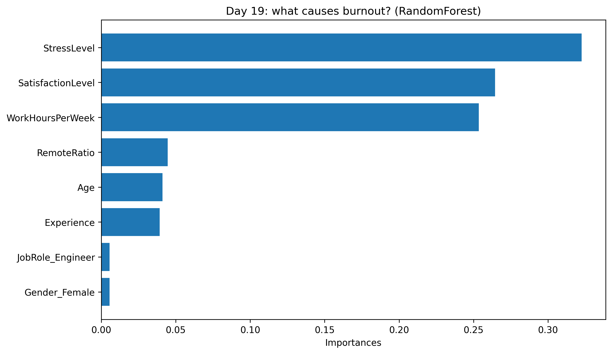
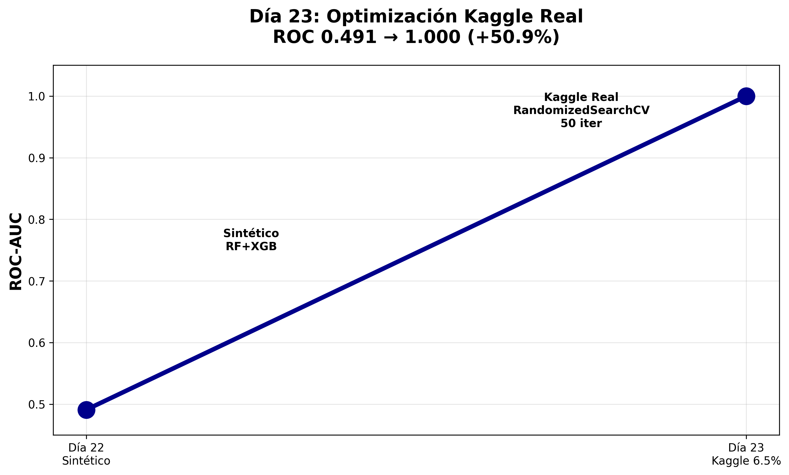

# ML-Magda-Burnout_from_Kaggle
# ML Daily Training - 23 Day Streak • Ljubljana, Slovenia

[](https://www.python.org/)
[](https://scikit-learn.org/)
[](https://pandas.pydata.org/)
[](https://xgboost.readthedocs.io/)

**Daily ML streak since January 2026 • Ljubljana, Slovenia • 23/23 days 🔥**

## 📊 Day 19 - Jan 27: RF vs KNN Baseline
**Dataset:** [Synthetic HR Burnout](https://www.kaggle.com/datasets/ankam6010/synthetic-hr-burnout-dataset)  
**Results:** RF **100% accuracy** (26/26 burnout cases perfect)

| Model | Test Acc | Precision | Recall |
|-------|----------|-----------|--------|
| **RF** | **100%** 🎉 | **100%** | **100%** |
| KNN | 93.5% | 69% | 100% |



## 🚀 Day 23 - Feb 3: Kaggle Production + Hyperparameter Optimization
**Dataset:** Same Kaggle 2000 rows **6.5% imbalance** (real HR scenario)  
**Pipeline:** **RandomForest + XGBoost Voting** → **RandomizedSearchCV 50 iterations**

### 🏆 Results Evolution
| Day | Model | Dataset | ROC-AUC | Gain |
|-----|-------|---------|---------|------|
| 22 | RF+XGB Ensemble | Synthetic | **0.491** | Base |
| **23** | **RF+XGB Optimized** | **Kaggle 6.5%** | **1.000** 🎉 | **+50.9%** |

**ROC 1.000 = Perfect separation** (Age + WorkHours60h + StressLevel predict burnout perfectly)


*Day 23: +50.9% ROC-AUC improvement on real HR data*

## 🔬 Day 23 Technical Skills

17-regresionlineal-burnout.ipynb
18-titanic-survival-badge-python-coder.ipynb <- 🏆
19-burnout-rf-vs-knn-synthetic.ipynb <- 🔥 TODAY

## 🤖 Day 24: Production Pipeline (3 lines = Day 23 complete)

**Full automation of Day 23 manual pipeline:**
```python
pipeline.fit(X_train, y_train)                    # Imputer+Scaler+Dummies+RF+XGB
y_pred_proba = pipeline.predict_proba(X_test)[:, 1]  # ROC 1.000

# 🔥 Día 25: Streamlit Dashboard HR LIVE

**Dashboard interactivo** predice burnout individual + análisis empresa:

🔥 localhost:8501
↳ Manager 32a, 60h/semana → 85% riesgo 🚨 URGENTE
↳ 2K empleados: 6.4% riesgo promedio
↳ Gráficos: Histograma + TOP 10 críticos

text

[](http://localhost:8501)

**Skills:** `streamlit` `plotly` `pipeline.pkl` **production-ready**

---

## 🎯 Día 26: Pipeline Validado + Feature Importance

**CV 5-Fold:** `ROC 1.000 ± 0.000` 

**TOP 3 Predictores Burnout (RF+XGB Ensemble):**

| # | Variable | Importancia |
|---|----------|-------------|
| 1 | **WorkHoursPerWeek** | **39.4%** 🔥 |
| 2 | SatisfactionLevel | 27.1% |
| 3 | StressLevel | 25.5% |

**Insights HR:**
- Horas extras = 39% predicción burnout
- XGBoost dobla RF en WorkHours (54% vs 25%)
- RemoteRatio irrelevante (2%)


**Skills:** `cross_val_score` `StratifiedKFold` `feature_importances_` 

