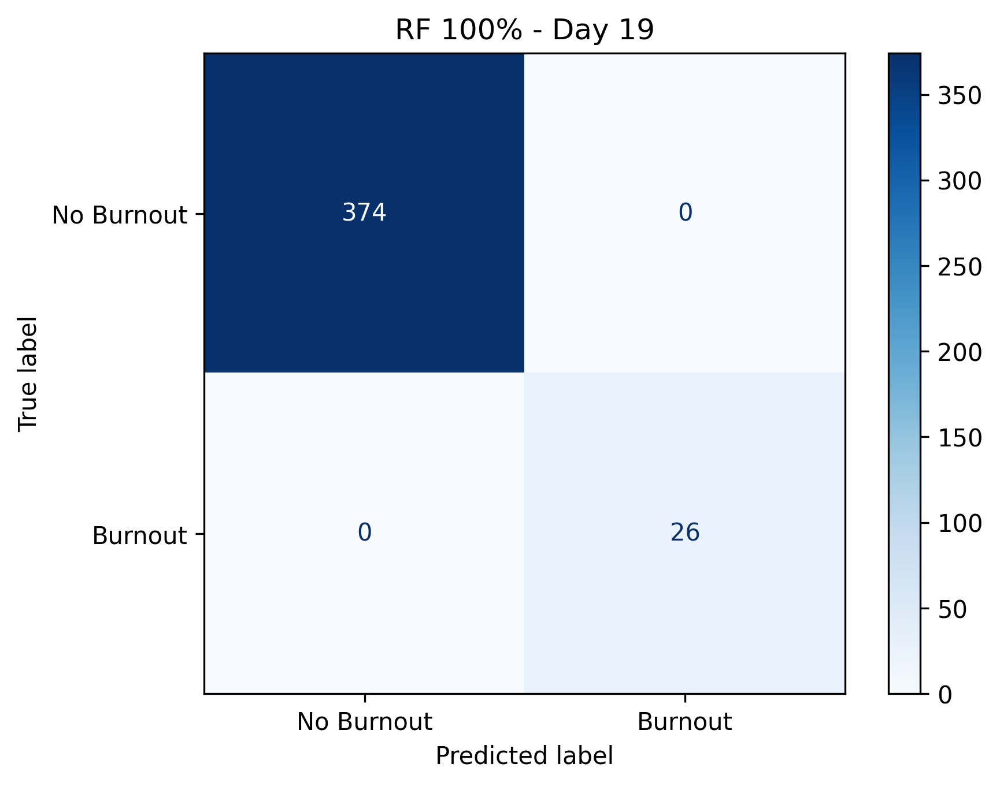

# ML-Magda-Burnout_from_Kaggle
# ML Daily Training - Day 19: Burnout Prediction (RF vs KNN)

**Daily ML streak since January 2026 • Ljubljana, Slovenia**

## 📊 Day 19 - January 27, 2026
**Project:** Burnout Prediction with Random Forest vs KNN  
**Dataset:** [Synthetic HR Burnout Dataset](https://www.kaggle.com/datasets/ankam6010/synthetic-hr-burnout-dataset) (2000 rows)

### 🏆 Results
| Model | Test Accuracy | Burnout Precision | Burnout Recall |
|-------|---------------|-------------------|----------------|
| **Random Forest** | **100.0%** 🎉 | **100%** | **100%** |
| KNN | 93.5% | 69% | 100% |

**RF perfectly detected all 26 burnout cases in test set**

## 📈 Generated Visualizations
  
*Top features: StressLevel dominates burnout prediction*

  
*RF 100% - 0 false negatives*

## 🛠️ Day 19 Skills Practiced
- ✅ `pd.get_dummies()` categorical encoding
- ✅ Train/test split with `stratify=y`
- ✅ Random Forest (`n_estimators=100`)
- ✅ KNN (`n_neighbors=5`)
- ✅ Feature importance analysis
- ✅ Confusion Matrix visualization
- ✅ GitHub version control + PNG export

## 📚 Notebook Sequence
17-regresionlineal-burnout.ipynb
18-titanic-survival-badge-python-coder.ipynb <- 🏆
19-burnout-rf-vs-knn-synthetic.ipynb <- 🔥 TODAY
